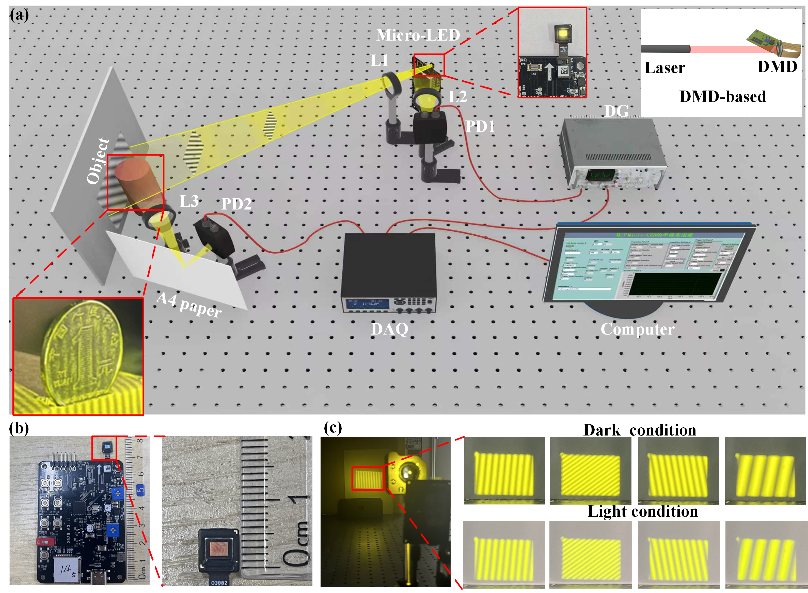
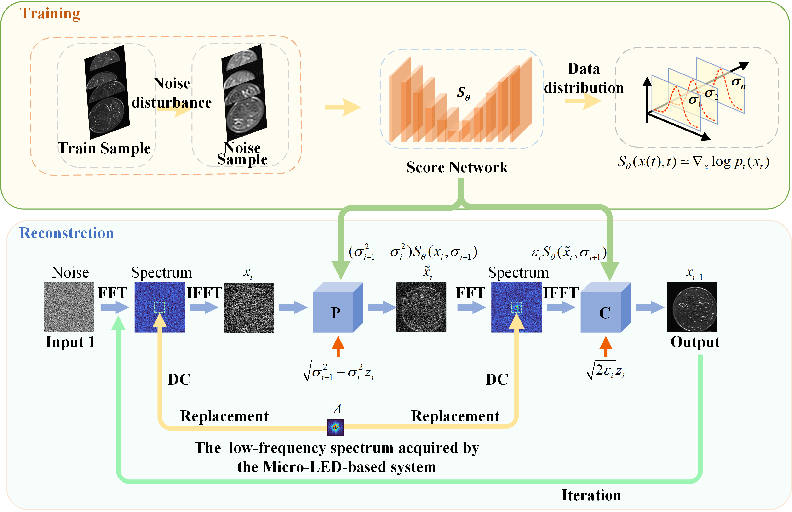
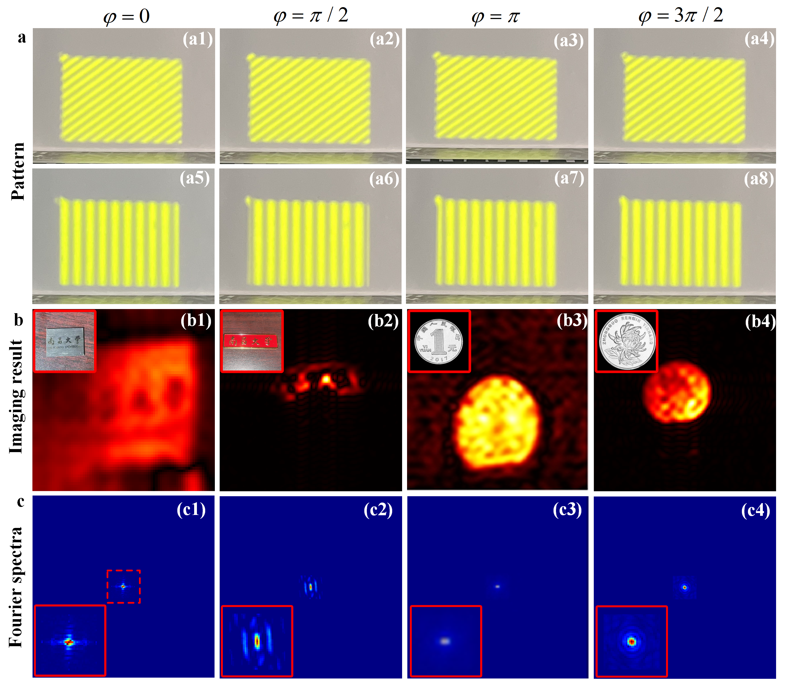
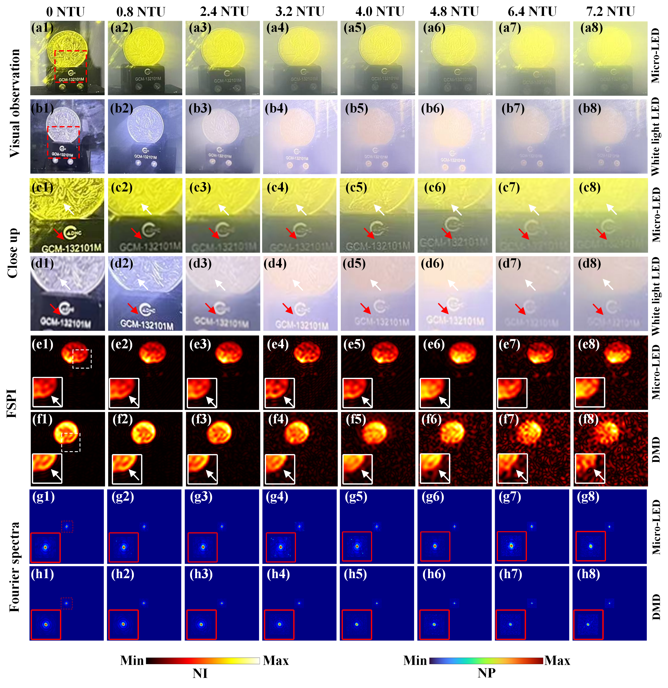
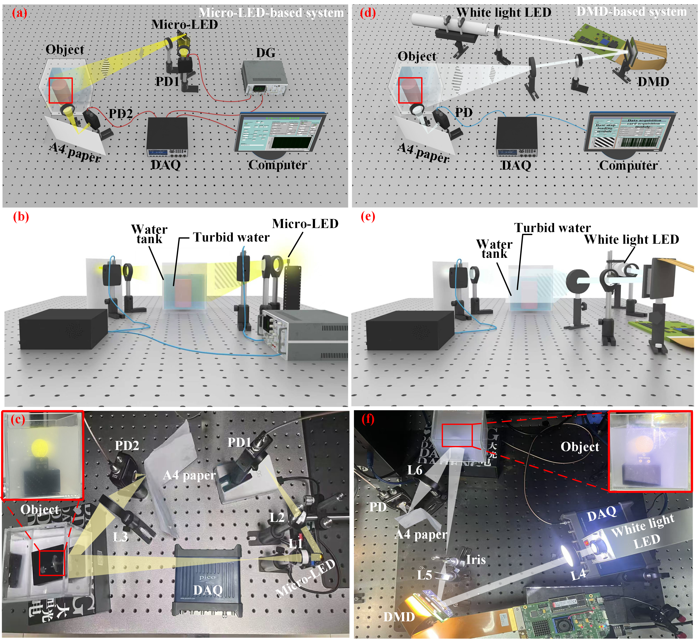
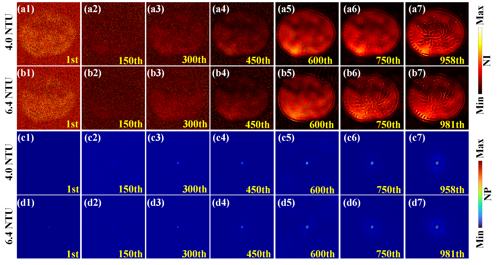
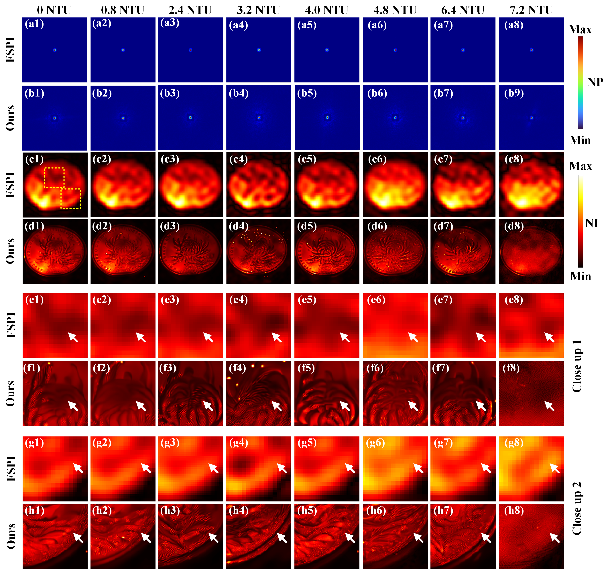

# Micro-LED-based-FSPI

## The Micro-LED-based system

## Flowchart of high-quality iterative reconstruction based on the diffusion model

## Imaging results of the Micro-LED-based system at the sampling rate of 1.67%

## FSPI underwater system

## The underwater imaging results of the coin obtained by FSPI at the sampling rate of 1.67%

## Iterative process of the coin (cropped region) under the turbidity of 4.0 NTU and 6.4 NTU

## Reconstruction results of the coin region images under the different NTU turbidity levels

train:
python main.py --config=aapm_sin_ncsnpp_gb.py --workdir=exp --mode=train --eval_folder=result

test:
python A_PCsampling_demo.py

test默认调用exp_demo下的模型

--workdir=exp_zl
--mode=train
--eval_folder=result
--config=aapm_sin_ncsnpp_gb.py

CUDA_VISIBLE_DEVICES=1 python main.py --config=aapm_sin_ncsnpp_gb.py --workdir=exp_zl --mode=train --eval_folder=result

vali[vali < 0] = 0
